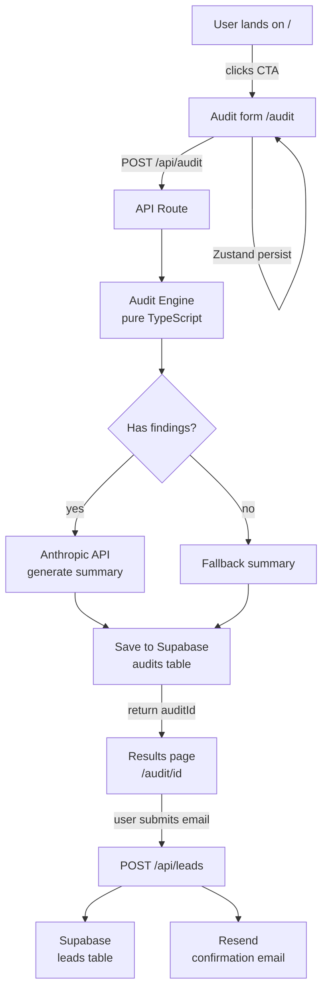

# Architecture

## System diagram

## Data flow

1. User fills form — Zustand stores state in localStorage so
   page reloads don't lose progress
2. On submit, POST /api/audit receives tools, teamSize, useCase
3. Audit engine runs pure TypeScript rules — no AI, no DB reads,
   just deterministic logic
4. AI summaries are generated through a lightweight summarisation layer
   with a deterministic fallback template if external AI calls fail 
   or are unavailable
5. Result + summary saved to Supabase with a nanoid(10) primary key
6. auditId returned to client — browser redirects to /audit/[id]
7. Results page is a Next.js server component — fetches from
   Supabase at request time, no client-side loading state needed
8. Email capture calls /api/leads — stores lead, sends email via
   Resend, returns immediately

## Stack choices

| Decision | Choice | Why |
|----------|--------|-----|
| Framework | Next.js 16 app router | Server components for results page mean no loading spinners and correct OG meta tags — critical for the shareable URL feature |
| Database | Supabase (Postgres) | Free tier, generous limits, built-in RLS so anon key is safe to expose, instant SQL editor for debugging |
| State | Zustand with persist | Form state survives reloads with 3 lines of code — simpler than Context + localStorage manually |
| Email | Resend | 3000 free emails/month, React email templates, excellent deliverability |
| Deployment | Vercel | Zero-config for Next.js, automatic deploys on push, free tier sufficient |
| Language | TypeScript | Audit engine types make it impossible to pass wrong data shapes between form and engine |

## What would change at 10k audits/day

- Add a Redis cache layer (Upstash) so repeated identical audits
  don't hit Supabase or Anthropic — most inputs are common
- Move Anthropic API call to a background job (Inngest or
  Trigger.dev) so /api/audit returns immediately and summary
  loads async — currently it blocks the response for 1-3s
- Add Supabase connection pooling (PgBouncer) — direct connections
  don't scale past ~100 concurrent
- Rate limit /api/audit by IP using Upstash Redis instead of the
  simple DB table approach used now
- Leverage Vercel edge caching for shareable audit result pages
  since it's static per auditId after first render

## Security considerations

- Supabase Row Level Security (RLS) is enabled on all public tables
- Service role key is only used in server-side API routes and never exposed to the client
- Public anon key only has insert/select access where explicitly allowed
- Email submission endpoints validate required fields before DB writes
- Audit IDs use nanoid(10) to avoid predictable sequential IDs