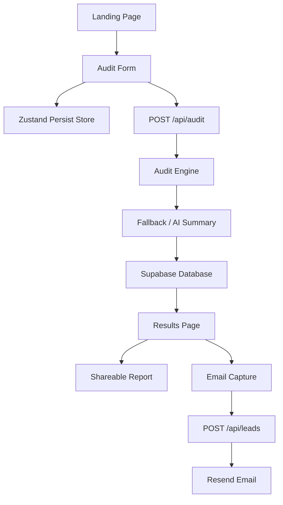

# SpendLens — AI spend auditing for modern teams

SpendLens is a lightweight SaaS tool that audits AI tool subscriptions
across teams and identifies redundant spend, overlapping tools,
and plan mismatches.

Teams enter their current AI stack (Cursor, Claude, ChatGPT, Copilot, etc.)
and instantly receive savings recommendations, projected annual savings,
and a shareable audit report.

---


---

## Live demo

* Live app: [https://ai-spend-audit-beta.vercel.app/](https://ai-spend-audit-beta.vercel.app/)
* GitHub repo: [https://github.com/SwedeshnaMishra/ai-spend-audit.git](https://github.com/SwedeshnaMishra/ai-spend-audit.git)

---

## Screenshots

### Landing page


### Audit results


---

## Core features

* AI tool spend auditing
* Savings projection engine
* Redundant tool detection
* Plan downgrade recommendations
* Shareable audit reports
* Persistent form state
* Email capture + follow-up flow
* Server-rendered results pages
* Mobile responsive UI
* Deterministic audit engine

---

## System architecture



---

## Tech stack

| Layer            | Technology            |
| ---------------- | --------------------- |
| Frontend         | Next.js 16 + React 19 |
| Styling          | Tailwind CSS          |
| Database         | Supabase              |
| State Management | Zustand               |
| Testing          | Vitest                |
| Email            | Resend                |
| Deployment       | Vercel                |
| Language         | TypeScript            |

---

## Architecture decisions

### 1. Deterministic audit engine instead of AI-generated recommendations

The audit logic itself uses hardcoded TypeScript rules rather than AI.
This guarantees that identical inputs always produce identical outputs,
which is critical for a finance-related product.

AI is only used for optional natural-language summaries.

### 2. Server-rendered results pages

Audit result pages are rendered on the server using Next.js App Router.
This allows:

* correct Open Graph previews
* instant page rendering
* shareable audit URLs
* no client-side loading spinners

### 3. Zustand persist middleware for form state

Zustand with persist middleware keeps audit progress in localStorage,
allowing users to refresh without losing work.

This was significantly simpler than manually managing hydration
through Context + localStorage.

### 4. nanoid for short audit URLs

Audit IDs use nanoid(10) instead of UUIDs.

Example:

```txt
/audit/V1StGXR8_Z
```

This creates cleaner and more shareable URLs.

### 5. Fallback summaries for reliability

If external AI calls fail or are unavailable,
SpendLens falls back to deterministic summaries built from audit data.

This guarantees the app always returns usable results.

---

## Security considerations

* Supabase Row Level Security (RLS) enabled on public tables
* Service role key only used inside server-side routes
* Public anon key restricted through RLS policies
* Audit IDs are non-sequential and difficult to guess
* Input validation performed before database writes

---

## Challenges faced

* Handling mixed-result audits where some tools had findings and others did not
* Ensuring projected spend calculations remained accurate
* Separating server/client component logic in Next.js App Router
* Preventing broken OG metadata for shareable links
* Managing persistent form state without overengineering

---

## Future improvements

* Team benchmark comparisons
* PDF export for finance reviews
* Background AI summary generation
* Stripe billing integrations
* Multi-workspace support
* Historical audit tracking
* Team analytics dashboard

---

## Local development

### Prerequisites

* Node.js 20+
* Supabase project
* Resend account

---

### Install

```bash
git clone https://github.com/YOUR_USERNAME/ai-spend-audit
cd ai-spend-audit
npm install
```

---

### Environment variables

Create `.env.local`

```env
NEXT_PUBLIC_SUPABASE_URL=your_supabase_url
NEXT_PUBLIC_SUPABASE_ANON_KEY=your_anon_key
SUPABASE_SERVICE_ROLE_KEY=your_service_role_key
RESEND_API_KEY=your_resend_key
NEXT_PUBLIC_BASE_URL=http://localhost:3000
```

---

### Run locally

```bash
npm run dev
```

Open:

```txt
http://localhost:3000
```

---

## Running tests

```bash
npm test
```

Audit engine tests cover:

* redundant tools
* pricing mismatches
* annual savings calculations
* projected spend correctness
* regression scenarios

---

## Deployment

The app is deployed on Vercel.

Every push to `main` automatically triggers:

* GitHub Actions CI
* ESLint checks
* Vitest test suite
* Vercel deployment

### Email delivery note

Email delivery currently runs in Resend testing mode,
which restricts outbound delivery to verified email addresses only.

The integration itself is fully functional and production-ready once
a custom domain is attached and verified in Resend.

---

## Project structure

```txt
project/
├── .github/
│   └── workflows/
│       └── ci.yml
│
├── public/
│
├── src/
│   ├── app/
│   │   ├── api/
│   │   │   ├── audit/
│   │   │   │   └── route.ts
│   │   │   └── leads/
│   │   │       └── route.ts
│   │   │
│   │   ├── audit/
│   │   │   ├── [id]/
│   │   │   │   └── page.tsx
│   │   │   └── page.tsx
│   │   │
│   │   ├── favicon.ico
│   │   ├── globals.css
│   │   ├── layout.tsx
│   │   ├── not-found.tsx
│   │   └── page.tsx
│   │
│   ├── components/
│   │   ├── results/
│   │   │   ├── AISummary.tsx
│   │   │   ├── CredexCTA.tsx
│   │   │   ├── EmailCapture.tsx
│   │   │   ├── HeroSavings.tsx
│   │   │   ├── ShareButton.tsx
│   │   │   └── ToolBreakdown.tsx
│   │   │
│   │   ├── ui/
│   │   │   ├── badge.tsx
│   │   │   ├── button.tsx
│   │   │   ├── card.tsx
│   │   │   ├── dialog.tsx
│   │   │   ├── input.tsx
│   │   │   ├── label.tsx
│   │   │   ├── select.tsx
│   │   │   ├── separator.tsx
│   │   │   ├── sonner.tsx
│   │   │   ├── table.tsx
│   │   │   └── textarea.tsx
│   │   │
│   │   ├── AddToolForm.tsx
│   │   ├── EmailCapture.tsx
│   │   ├── TeamContext.tsx
│   │   └── ToolsList.tsx
│   │
│   └── lib/
│       ├── __tests__/
│       │   └── audit-engine.test.ts
│       ├── audit-engine.ts
│       ├── pricing.ts
│       ├── store.ts
│       ├── supabase.ts
│       └── utils.ts
│ 
├── docs/
│   ├── screenshot-landing.png
│   └── screenshot-results.png
│
├── .env.local
├── .eslintrc.json
├── ARCHITECTURE.md
├── DEVLOG.md
├── ECONOMICS.md
├── GTM.md
├── LANDING_COPY.md
├── USER_INTERVIEWS.md
├── REFLECTION.md
├── TESTS.md
├── PROMPTS.md
├── METRICS.md
├── PRICING_DATA.md
├── README.md
├── components.json
├── eslint.config.mjs
├── next.config.ts
├── package.json
├── postcss.config.mjs
└── tsconfig.json
```

---

## Why this project exists

AI tool spend is becoming a hidden SaaS cost for modern engineering teams.

Most startups adopt tools incrementally:

* Cursor
* Claude
* ChatGPT
* GitHub Copilot
* Perplexity
* API subscriptions

Over time, overlapping subscriptions and unnecessary upgrades create waste.

SpendLens was built to make those inefficiencies visible in seconds.

---

## Project Maintainer

**Github:** [Swedeshna Mishra](https://github.com/SwedeshnaMishra)
